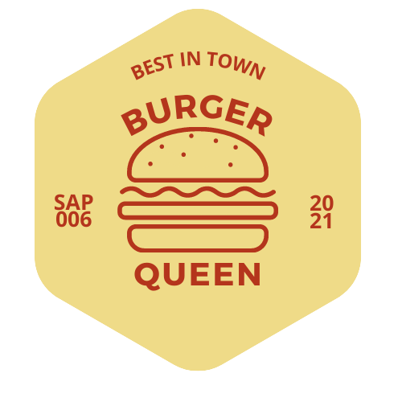

# Burger Queen (API Client)

## :round_pushpin: Índice

- [1. Sobre o Projeto](#1-sobre-o-projeto)
- [2. Resumo do projeto](#2-resumo-do-projeto)
- [3. Conteúdos Abordados](#3-conteudos-abordados)
- [4. Sobre o Produto](#4-sobre-o-produto)
- [5. Desenvolvedoras](#5-desenvolvedoras) 

## 1. Sobre o Projeto :computer:

Um pequeno restaurante de hambúrgueres, que está crescendo, necessita uma
interface em que se possa realizar pedidos utilizando um _tablet_, e enviá-los
para a cozinha para que sejam preparados de forma ordenada e eficiente.

Este projeto tem duas áreas: interface (cliente) e API (servidor). Nosso
cliente nos pediu para desenvolver uma interface que se integre com a API
que outra equipe de desenvolvedoras está trabalhando simultaneamente.

[React](https://reactjs.org/)
é um dos _frameworks_ e _bibliotecas_ de JavaScript mais usados
na área de desenvolvimento ao redor do mundo e existe uma razão para isso.
No contexto do navegador, [_manter a interface sincronizada com o estado é
difícil_](https://medium.com/dailyjs/the-deepest-reason-why-modern-javascript-frameworks-exist-933b86ebc445).
Ao eleger um _framework_ ou _biblioteca_ para nossa interface, nos apoiamos em
uma série de convenções e implementações _testadas_ e _documentadas_ para
resolver um problema comum a toda interface web. Isto nos permite concentrar
melhor (dedicar mais tempo) nas características _específicas_ de nossa
aplicação.

Quando escolhemos uma destas tecnologias não só importamos um pedaço de código
para reusar (o qual já é um grande valor por si só), mas também adotamos uma
**arquitetura**, uma série de **princípios de design**, um paradigma, algumas
**abstrações**, um **vocabulário**, uma **comunidade**, etc...

Como desenvolvedora Front-End, estes kits de desenvolvimento podem resultar em
uma grande ajuda para implementar rapidamente características dos projetos em que
você for trabalhar.

## 2. Resumo do projeto :page_facing_up:

Desta vez temos um projeto 100% por demanda. Você sempre pode (e deve) fazer
sugestões de melhora e mudança, mas muitas vezes trabalhará em um projeto em que
primeiro deve se assegurar de cumprir os requisitos.

:pushpin: **Informações do cliente:**

:ledger: :ledger: :ledger: :ledger: IMAGEM CLIENTEEEEEEEEEEEEEEEEEE :ledger: :ledger:

Além disso a cliente nos deu um [link da documentação](https://lab-api-bq.herokuapp.com/api-docs/)
que especifica o comportamento esperado da API que iremos expor por HTTP.
Lá podemos encontrar todos os detalhes dos _endpoints_, como por exemplo
que parâmetros esperam, o que devem responder, etc.

O objetivo principal é aprender a construir uma _interface web_ usando o
_framework_ escolhido (React). Esse framework front-end ataca
o seguinte problema: **como manter a interface e estado sincronizados**.
Portanto, esta experiência espera familiarizá-la com o conceito de _estado da
tela_, e como cada mudança no estado vai refletir na interface (por exemplo,
toda vez que adicionamos um _produto_ para um _pedido_, a interface deve
atualizar a lista de pedidos e o total).

## 3. Conteúdos Abordados :mortar_board:
#### HTML
- [x] Uso de HTML semântico

#### CSS
- [x] Uso de seletores de CSS
- [x] Empregar o modelo de caixa (box model): borda, margem, preenchimento
- [x] Uso de flexbox em CSS
- [x] Uso de CSS Grid Layout
- [x] Uso de media queries

#### JavaScript
- [x] Testes unitários
- [x] Testes assíncronos
- [x] Mocking
- [x] Uso ES modules
- [x] Uso de linter (ESLINT)
- [x] Uso de identificadores descritivos (Nomenclatura | Semântica)

#### Git e GitHub
- [x] Git: Instalação e configuração
- [x] Git: Controle de versão com git (init, clone, add, commit, status, push, pull, remote)
- [x] Git: Integração de mudanças entre ramos (branch, checkout, fetch, merge, reset, rebase, tag)
- [x] GitHub: Criação de contas e repositórios, configuração de chave SSH
- [x] GitHub: Implantação com GitHub Pages
- [x] GitHub: Colaboração pelo Github (branches | forks | pull requests | code review | tags)
- [x] GitHub: Organização pelo Github (projects | issues | labels | milestones | releases)

#### HTTP
- [x] Solicitações o requisições (request) e respostas (response).
- [x] Cabeçalhos (headers)
- [x] Corpo (body)
- [x] Verbos HTTP
- [x] Codigos de status de HTTP
- [x] Encodings e JSON
- [x] CORS (Cross-Origin Resource Sharing)

#### React
- [x] Jsx
- [x] Components
- [x] Events
- [x] Lists-and-keys
- [x] Conditional-rendering
- [x] Lifting-up-state
- [x] Hooks
- [x] CSS-modules
- [x] Routing

#### UX (User Experience)
- [x] Desenhar a aplicação pensando e entendendo o usuário
- [x] Criar protótipos para obter feedback e iterar
- [x] Aplicar os princípios de desenho visual (contraste, alinhamento, hierarquia)
- [x] Planejar e executar testes de usabilidade

## 4. Sobre o Produto :open_file_folder:

### Definição do produto :dart:

O _Product Owner_ nos apresentou
este _backlog_ que é o resultado do seu trabalho com o cliente até hoje.

---

#### 1ª Historia de Usuário :newspaper:
👨‍💼 👩‍💼 Garçom/Garçonete deve poder entrar no sistema:

IMAGEM 1 HISTORIA

---

#### 2ª História de Usuário :newspaper:
👨‍💼 👩‍💼 Garçom/Garçonete deve ser capaz de anotar o pedido do cliente:
 
 
 
IMAGEM 2 HISTORIA
 

---

#### 3ª História de Usuário :newspaper:
👨‍🍳 👩‍🍳  Chefe de cozinha deve ver os pedidos:

IMAGEM 3 HISTORIA

---

#### 4ª Historia de Usuário :newspaper:
👨‍💼 👩‍💼 Garçom/Garçonete deve ver os pedidos prontos para servir:

IMAGEM 4 HISTORIA

---

## 5. Desenvolvedoras :woman_technologist:  

### :woman_artist: Carmen
[GitHub](https://github.com/carmemilya) [LinkedIn](https://www.linkedin.com/in/carmen-emilia-gozza/)

### :woman_artist: Liziane
[GitHub](https://github.com/lizianegarcia)  [LinkedIn](https://www.linkedin.com/in/lizianegarciadarosa/)

